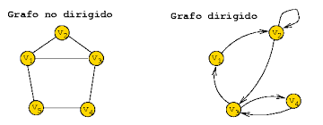
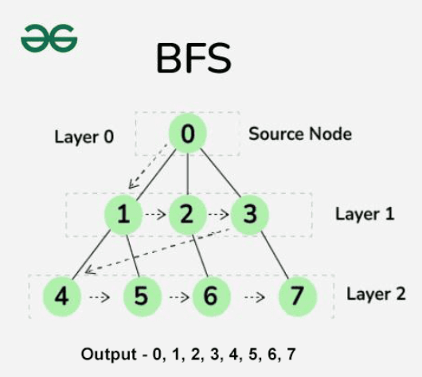
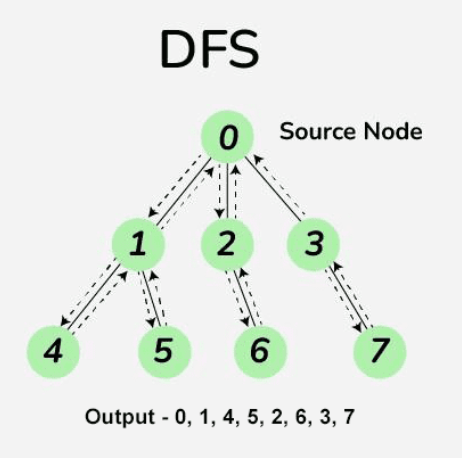
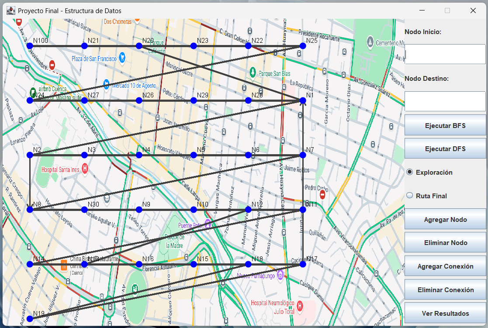

# Proyecto Final – Estructura de Datos

## Sistema de Búsqueda de Rutas en Grafos mediante BFS y DFS

**Integrantes:** Janelly Dayanna Chacha Vélez, Kelly Valeria Guamán León

**Asignatura:** Estructura de Datos

**Fecha:** 09-02-2026

---
## 1. Introducción

Las estructuras no lineales permiten modelar problemas reales donde los elementos no siguen un orden secuencial. Una de las estructuras más importantes es el **grafo**, el cual permite representar redes de caminos, mapas, redes sociales o sistemas de transporte.

En el presente proyecto se desarrolló una aplicación gráfica que permite construir un grafo sobre un mapa e identificar rutas entre dos nodos seleccionados por el usuario. Para ello se implementaron los algoritmos de búsqueda **Breadth First   Search (BFS)** y **Depth First Search (DFS)**, permitiendo visualizar el recorrido y comparar su comportamiento.

El sistema además registra los tiempos de ejecución y mantiene persistencia de la información aun después de cerrar el programa.

---
## 2. Objetivos

### Objetivo General

Desarrollar una aplicación que represente un grafo y permita analizar rutas utilizando algoritmos de búsqueda.

### Objetivos Específicos

* Representar grafos mediante listas de adyacencia.
* Implementar BFS para búsqueda por niveles.
* Implementar DFS utilizando recursión.
* Visualizar gráficamente los recorridos.
* Medir el tiempo de ejecución de los algoritmos.
* Guardar y recuperar la información del grafo.
* Aplicar el patrón Modelo-Vista-Controlador.

---
## 3. Marco Teórico

### 3.1 Grafos

Un grafo es una estructura de datos compuesta por un conjunto de vértices (nodos) y aristas (conexiones). Permite modelar relaciones entre elementos. En este proyecto se utilizó un grafo no ponderado representado mediante **listas de adyacencia**.

### 3.2 Algoritmo BFS (Breadth First Search)

BFS recorre el grafo por niveles utilizando una cola. Primero visita todos los vecinos inmediatos del nodo inicial y posteriormente continúa con los siguientes niveles.
Su principal característica es que garantiza encontrar la **ruta más corta** en grafos no ponderados.

### 3.3 Algoritmo DFS (Depth First Search)

DFS recorre el grafo en profundidad. Avanza por un camino hasta que no puede continuar y luego retrocede.
Se implementa mediante **recursión**, utilizando implícitamente la pila del sistema. No garantiza la ruta más corta, pero suele requerir menos memoria.

### 3.4 Persistencia de Datos

La persistencia permite almacenar información en archivos externos para recuperarla posteriormente. En este proyecto los nodos y conexiones del grafo se guardan en un archivo de texto, permitiendo que el sistema mantenga los cambios realizados por el usuario.

### 3.5 Arquitectura MVC

El sistema se diseñó siguiendo el patrón **Modelo-Vista-Controlador (MVC)**:

* Modelo: estructura del grafo y algoritmos.
* Vista: interfaz gráfica.
* Controlador: comunicación entre usuario y sistema.

---

## 4. Metodología
Primero se diseñó la estructura del grafo y la clase nodo. Posteriormente se implementaron los algoritmos BFS y DFS para la búsqueda de rutas. Luego se desarrolló la interfaz gráfica en Java Swing para permitir la interacción del usuario.

Se añadieron funciones para agregar y eliminar nodos, crear conexiones y visualizar los recorridos. Finalmente se incorporó persistencia mediante archivos de texto y medición de tiempos de ejecución guardados en un archivo CSV.

---

## 5. Funcionamiento del Sistema
El usuario ingresa un nodo inicial y un nodo destino. El sistema ejecuta el algoritmo seleccionado (BFS o DFS), calcula la ruta, mide el tiempo de ejecución y muestra el recorrido sobre el mapa.

El programa permite:

* Crear nodos
* Eliminar nodos
* Conectar nodos
* Ejecutar BFS
* Ejecutar DFS
* Visualizar la exploración
* Ver la ruta final
* Guardar automáticamente el grafo

---

## 6. Resultados
Durante las pruebas se observó que BFS siempre encuentra la ruta más corta entre dos nodos, mientras que DFS puede encontrar rutas más largas dependiendo del orden de exploración.

También se comprobó que DFS suele ejecutarse ligeramente más rápido en grafos pequeños, pero BFS es más confiable para encontrar la mejor ruta.

Los tiempos de ejecución quedan registrados en un archivo CSV para su análisis.

---

## 7. Conclusiones

El proyecto permitió aplicar de manera práctica el uso de grafos y algoritmos de búsqueda. Se comprobó la diferencia real entre BFS y DFS y la importancia de elegir el algoritmo adecuado según el problema.

Además, la implementación bajo el patrón MVC permitió organizar correctamente el código, facilitando su mantenimiento y comprensión. La persistencia de datos permitió conservar la información del grafo entre ejecuciones, haciendo el sistema funcional y completo.

---

## 8. Requisitos

* Java JDK 17 o superior
* Visual Studio Code
* Java Extension Pack

---

## 9. Ejecución

Compilar y ejecutar la clase:

